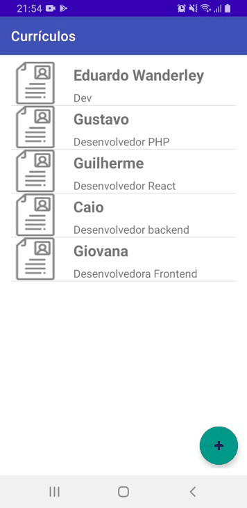
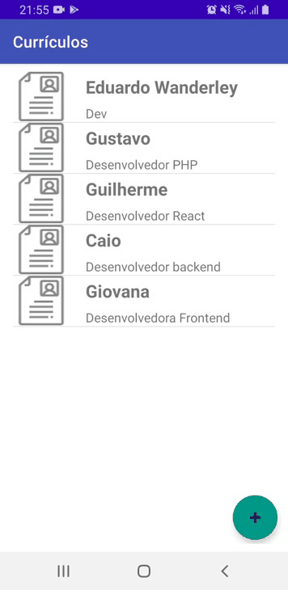

# DevRegistration

## App mobile para gerenciamento de currículos, desenvolvido como atividade   para a disciplina de Programação para dispositívos móveis da   <a href = "https://www.ucsal.br/"> Universidade Católica Do Salvador - UCSAL<a>.

 <a href="#features">Features</a> •
 <a href="#experimente">Experimente</a> • 
 <a href="#tecnologias">Tecnologias</a> • 
 <a href="#equipe">Equipe</a> 

### Features

- [x] Cadastrar currículo.
- [x] Acesso a webservice viaCEP para obter endereço a partir do CEP.
- [x] Excluir currículo.
- [x] Visualizar currículo.
- [x] Exportar currículo como PDF.

  <kbd>
    
  </kbd>
  &nbsp;&nbsp;&nbsp;&nbsp;
  <kbd>
    
  </kbd>
  &nbsp;&nbsp;&nbsp;&nbsp;
  <kbd>
    
  </kbd>

### Experimente

Antes de começar, é recomendado você ter instalado em sua máquina as seguintes ferramentas:  

- [Git](https://git-scm.com)
- [Java](https://www.oracle.com/java/technologies/downloads/)  
- [Android Studio](https://developer.android.com/studio?hl=pt&gclid=Cj0KCQiAhf2MBhDNARIsAKXU5GRj1FvBFLz2GpaqPOT6xUI-v-3Jlz-L_qA9FUO2jQl8QQ1bkEOorvEaAoxwEALw_wcB&gclsrc=aw.ds)

#### Veja também :  
[Como rodar um app no android studio](https://developer.android.com/training/basics/firstapp/running-app?hl=pt-br)

### Tecnologias

As seguintes ferramentas foram usadas na construção do projeto:

- [Java](https://expo.io/)
- [Room Database](https://developer.android.com/training/data-storage/room)
- [Gson](https://github.com/google/gson)

### Equipe

<table>
  <tr>
    <td align="center"><a href="https://github.com/guilhermefcs7"> <b>Guilherme Falcão</b></a> <a href="" title="Guizinho">👨‍🚀</a></td>
    <td align="center"><a href="https://github.com/ccaiomacedo"> <b>Caio Macedo</b></a> <a href="" title="Caiax">👨‍🚀</a></td>
    <td align="center"><a href="https://github.com/Gustavodecarvalho834"> <b>Gustavo Carvalho</b></a> <a href="" title="gusta">👨‍🚀</a></td>
    <td align="center"><a href="https://github.com/eduardowanderleydev"> <b>Eduardo Wanderley</b></a> <a href="" title="">🚀</a></td>
  </tr>

</table>

